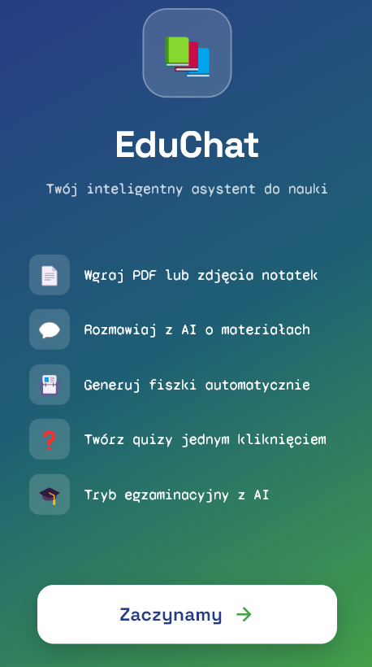
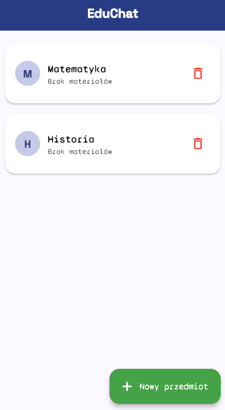
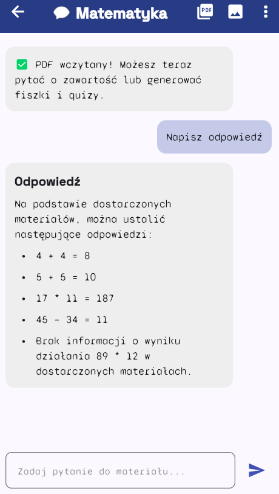
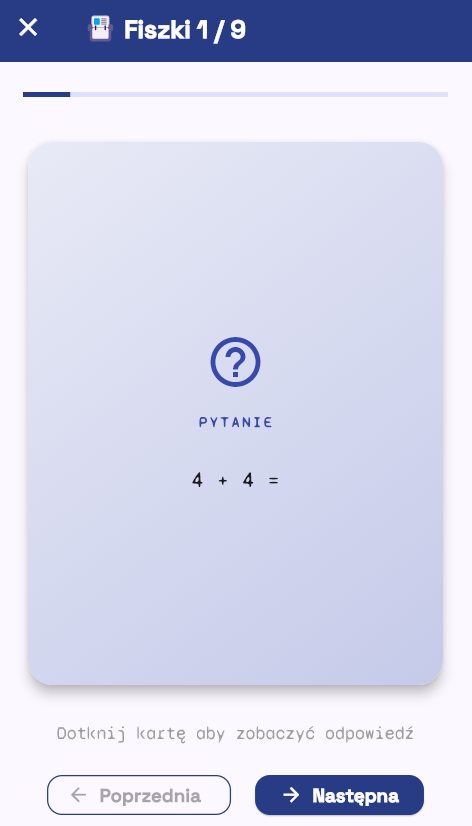
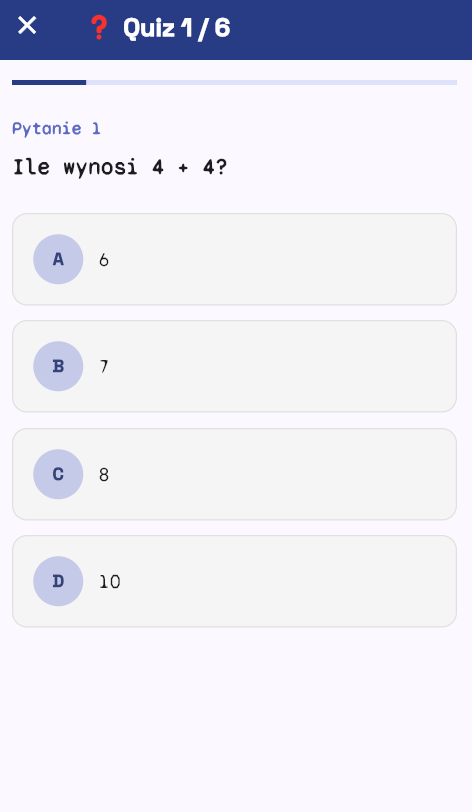
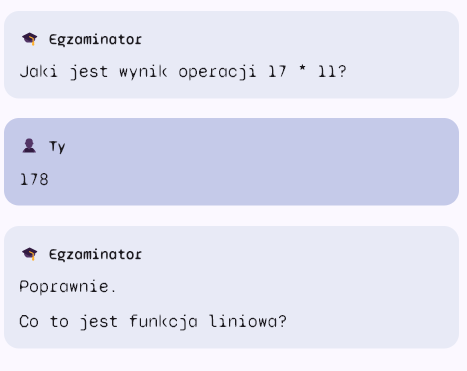

# EduChat — Aplikacja do Nauki z Asystentem AI

> Mobilna aplikacja Flutter, w której student wgrywa materiały (PDF, zdjęcia notatek) i może z nimi rozmawiać, generować fiszki, quizy oraz być odpytywany przez AI.


---

## Funkcje

| Funkcja | Opis |
|---|---|
| **Upload PDF** | Wgraj skrypt lub podręcznik — tekst wyodrębniany lokalnie (Syncfusion) |
| **Upload zdjęcia notatek** | Zrób zdjęcie ręcznych notatek — AI odczyta tekst (OCR przez Groq Vision) |
| **Chat z AI** | Zadawaj pytania do swoich materiałów — AI odpowiada wyłącznie na ich podstawie |
| **Streaming odpowiedzi** | Tekst pojawia się słowo po słowie w czasie rzeczywistym (SSE) |
| **Generowanie fiszek** | AI tworzy 8–10 par pytanie/odpowiedź z animacją obrotu karty |
| **Generowanie quizów** | 5–6 pytań wielokrotnego wyboru (A/B/C/D) z oceną wyników |
| **Tryb odpytywania** | AI wciela się w egzaminatora — zadaje pytania i ocenia odpowiedzi studenta |
| **Historia rozmów** | Każdy przedmiot ma własną historię czatu zapisaną lokalnie |
| **Tryb offline** | Dane przechowywane lokalnie w Hive (bez potrzeby konta/chmury) |

---

## Stack technologiczny

| Warstwa | Technologia |
|---|---|
| Framework | Flutter 3.x / Dart 3.x |
| Zarządzanie stanem | `flutter_bloc` 8.x |
| AI — czat i generowanie | Groq API (model `llama-3.3-70b-versatile`) |
| AI — OCR zdjęć | Groq Vision (`llama-4-scout-17b-16e-instruct`) |
| Parsowanie PDF | `syncfusion_flutter_pdf` (lokalnie, bez uploadu) |
| Baza danych | Hive (lokalny NoSQL) |
| Streaming | SSE (Server-Sent Events) przez `dio` |
| Fonty | Space Grotesk, Syne Mono (Google Fonts) |
| UI | Material Design 3 |

---

## Architektura

Projekt oparty na **Clean Architecture** z podziałem na trzy warstwy:

```
presentation/          # UI — strony, BLoC (flutter_bloc)
├── bloc/
│   └── study_bloc.dart      # Główny BLoC z 19 zdarzeniami
└── pages/
    ├── splash_page.dart
    ├── subjects_page.dart
    ├── chat_page.dart
    ├── flashcards_page.dart
    ├── quiz_page.dart
    └── exam_mode_page.dart

domain/               # Logika biznesowa — encje, interfejsy
├── entities/          # Subject, Message, Flashcard, QuizQuestion
└── repositories/      # Abstrakcyjny interfejs StudyRepository

data/                 # Implementacje — API, baza danych
├── datasources/
│   ├── groq_client.dart            # Groq AI (aktywny)
│   ├── anthropic_client.dart       # Claude API (przygotowany)
│   ├── local_data_source.dart      # Hive storage
│   └── text_extraction_service.dart # PDF → tekst (Syncfusion)
└── repositories/
    └── study_repository_impl.dart
```

**Przepływ danych:**
```
Strona → zdarzenie BLoC → Repository → Groq API / Hive → nowy Stan → UI
```

---

## Instalacja

### Wymagania

- Flutter SDK 3.x
- Dart 3.x
- Konto Groq (darmowe): [console.groq.com](https://console.groq.com)

### Kroki

```bash
# Klonuj repozytorium
git clone <url-repo>
cd first_app

# Zainstaluj zależności
flutter pub get

# Wgraj klucz API (patrz niżej)
# Uruchom aplikację
flutter run
```

### Konfiguracja klucza API

Otwórz `lib/core/config.dart` i wstaw swój klucz Groq:

```dart
static const String groqApiKey = 'gsk_TWÓJ_KLUCZ_TUTAJ';
```

Klucz API uzyskasz bezpłatnie na [console.groq.com](https://console.groq.com).

---

## Jak działa RAG (uproszczony)

Aplikacja nie używa wektorowej bazy danych. Zamiast tego przy każdym pytaniu do API wysyłany jest pełny tekst materiałów (do 24 000 znaków) wraz z pytaniem studenta:

```
MATERIAŁY:
[wyodrębniony tekst z PDF/zdjęcia]

PYTANIE:
[pytanie studenta]
```

AI odpowiada wyłącznie na podstawie dostarczonych materiałów — jeśli odpowiedź nie jest w tekście, informuje o tym.

---

## Zrzuty ekranu

| | | |
|---|---|---|
|  |  |  |
| Ekran startowy | Lista przedmiotów | Chat z AI |
|  |  |  |
| Fiszki | Quiz | Tryb odpytywania |

---

## Licencja

MIT License — możesz swobodnie używać, modyfikować i dystrybuować.

---

*Zbudowane z Flutter + Groq AI*
